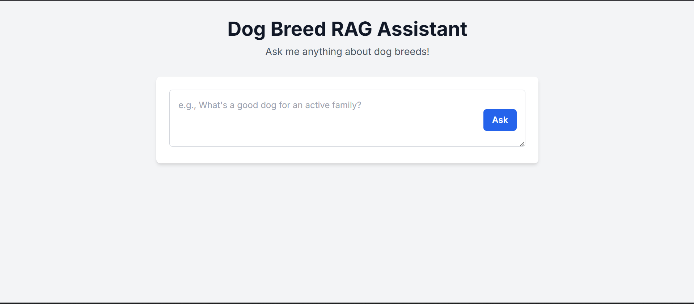

# 🐾 PawGPT - Your AI Dog Breed Assistant


-green.svg)



PawGPT is an intelligent web application designed to help users find the perfect dog breed based on their lifestyle and preferences. It uses a **Retrieval-Augmented Generation (RAG)** pipeline to provide smart, context-aware recommendations from natural language questions.

---

## ✨ Features

-   **Natural Language Queries**: Ask complex questions like, "What's a good, low-energy dog for a small apartment that doesn't bark a lot?"
-   **Intelligent Retrieval**: Uses semantic search with a ChromaDB vector store to find the most relevant dog breeds from a comprehensive knowledge base.
-   **AI-Generated Answers**: Leverages a Large Language Model (Llama 3.1) via the high-speed Groq API for fast, human-like responses.
-   **Simple Web Interface**: Built with Flask and Tailwind CSS for a clean and responsive user experience.
[PawGPT Sample Query](demo/pawgpt_recording.mp4)

---

## 🛠️ Technology Stack

-   **Backend**: Flask
-   **AI/ML Framework**: LangChain
-   **LLM Provider**: Groq API (Llama 3.1)
-   **Embedding Model**: `all-MiniLM-L6-v2`
-   **Vector Database**: ChromaDB
-   **Data Manipulation**: Pandas
-   **Web Scraping**: Requests, BeautifulSoup

---

## 📂 Project Structure

The repository is organized to separate data preparation scripts from the main application logic.

```
pawgpt/
│
├
├── README.md               # This file
├── requirements.txt        # Lists all Python packages needed for the project
│
├── app.py                  # The main Flask web application file
│
├── data/
│   └── dogs_final_for_rag.csv  # The final, enriched dataset
│
├── demo/
│   ├── pawgpt_image.png      # Demo image of the application
│   └── pawgpt_recording.mp4  # Demo video of the application
│
├── scripts/
│   └── 1_create_vector_db.py # One-time script to build the vector database
│
└── templates/
    └── index.html          # The HTML frontend for the web app
```

---

## 🚀 Getting Started

Follow these instructions to set up and run the project locally.

### 1. Prerequisites

-   Python 3.9 or higher
-   Git

### 2. Setup and Installation

**Step A: Clone the Repository**
Open your terminal and clone this repository to your local machine.

```bash
git clone [https://github.com/your-username/pawgpt.git](https://github.com/your-username/pawgpt.git)
cd pawgpt
```

**Step B: Create a Virtual Environment (Recommended)**
It's best practice to create a virtual environment to manage project dependencies.

```bash
# For Windows
python -m venv venv
venv\Scripts\activate

# For macOS/Linux
python3 -m venv venv
source venv/bin/activate
```

**Step C: Install Dependencies**
Install all the required Python packages using the `requirements.txt` file.

```bash
pip install -r requirements.txt
```

**Step D: Set Up Your API Key**
You will need an API key from [Groq](https://console.groq.com/keys) to use the LLM.

1.  Open the `app.py` file.
2.  Find the line `GROQ_API_KEY = "your_groq_api_key"`
3.  Replace `"your_groq_api_key"` with your actual Groq API key.

### 3. How to Run the Application

The application requires a one-time setup to build the knowledge base, followed by running the web server.

**Step A: Build the Vector Database (One-Time Only)**
Run the script to process your data and create the `db_chroma` vector store.

```bash
python scripts/1_create_vector_db.py
```
This will create a `db_chroma` folder in your project directory. You only need to do this once.

**Step B: Start the Web Application**
Now, run the main Flask application.

```bash
python app.py
```

Your terminal should display a message indicating that the server is running, usually on `http://127.0.0.1:5000`.

**Step C: Use the App!**
Open your web browser and navigate to **`http://127.0.0.1:5000`**. You can now start asking questions!

---

## Limitations
- The web application can be improvised by a more responsive and colorful UI.
- Sometimes, the assistant responds with 'Not Enough Information' which may call for better retrieval methods.
- A chat history feature can be added!

## 🤝 Contributing

Contributions are welcome! If you have suggestions for improvements or find any issues, please feel free to open an issue or submit a pull request.

---

## 📄 License

This project is licensed under the MIT License. See the `LICENSE` file for details.
