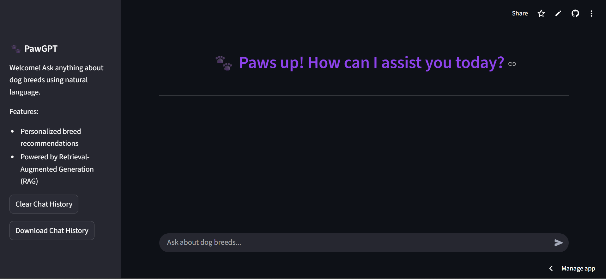

# 🐾 PawGPT - Your AI Dog Breed Assistant


-green.svg)




PawGPT is an intelligent web application designed to help users find the perfect dog breed based on their lifestyle and preferences. It uses a **Retrieval-Augmented Generation (RAG)** pipeline to provide smart, context-aware recommendations from natural language questions.

---

## ✨ Features

-   **Natural Language Queries**: Ask complex questions like, "What's a good, low-energy dog for a small apartment that doesn't bark a lot?"
-   **Intelligent Retrieval**: Uses semantic search with a Pinecone vector database to find the most relevant dog breeds from a comprehensive knowledge base.
-   **AI-Generated Answers**: Leverages a Large Language Model (Llama 3.1) via the high-speed Groq API for fast, human-like responses.
-   **Simple Web Interface**: Built with Streamlit for a clean and responsive user experience.
-   **Cloud-Hosted Vector Database**: Uses Pinecone for scalable, serverless vector storage and retrieval.
-   **Chat History**: Download your conversation history for future reference.

https://github.com/user-attachments/assets/b0a01fa5-fde1-4a34-b913-5f552ed38f76

---

## 🛠️ Technology Stack

-   **Frontend & Backend**: Streamlit
-   **AI/ML Framework**: LangChain
-   **LLM Provider**: Groq API (Llama 3.1 8B Instant)
-   **Embedding Model**: `all-MiniLM-L6-v2` (HuggingFace)
-   **Vector Database**: Pinecone (Cloud-hosted)
-   **Data Manipulation**: Pandas

---

## 📂 Project Structure

The repository is organized to separate data preparation scripts from the main application logic.

```plaintext
pawgpt/
│
├── README.md                  # Project overview and usage instructions
├── LICENSE                    # MIT license
├── requirements.txt           # Pinned Python dependencies
├── .gitignore                 # Keeps secrets and local artifacts out of git
├── streamlit_app.py           # Main Streamlit application file
│
├── .streamlit/
│   └── secrets.toml.example   # Template for local API keys (copy to secrets.toml)
│
├── .devcontainer/
│   └── devcontainer.json      # GitHub Codespaces / VS Code dev container
│
├── data/
│   └── dogs_final_for_rag.csv # Final, enriched dataset used for RAG
│
├── demo/
│   ├── pawgpt_image.png       # Demo image of the application
│   └── pawgpt_recording.mov   # Demo video of the application
│
└── scripts/
    └── pinecone_db.py         # Script to upload vectors to Pinecone (one-time setup)
```

---

## 🚀 Getting Started

Follow these instructions to set up and run the project locally.

### 1. Prerequisites

-   Python 3.9 or higher
-   Git
-   A Groq API key ([Get one here](https://console.groq.com/keys))
-   A Pinecone API key ([Get one here](https://www.pinecone.io/))

### 2. Setup and Installation

**Step A: Clone the Repository**
Open your terminal and clone this repository to your local machine.

```bash
git clone https://github.com/sohamwas/pawgpt.git
cd pawgpt
```

**Step B: Install Dependencies**
Install all the required Python packages using the `requirements.txt` file. A virtual
environment is recommended, since `sentence-transformers` pulls in PyTorch.
```bash
python -m venv .venv
source .venv/bin/activate      # Windows: .venv\Scripts\activate
pip install -r requirements.txt
```

**Step C: Configure Your API Keys**
Copy the template and fill in your own keys:
```bash
cp .streamlit/secrets.toml.example .streamlit/secrets.toml
```
`.streamlit/secrets.toml` is gitignored. The app reads two keys, `pinecone_api_key`
and `groq_api_key`, and also accepts them as the environment variables
`PINECONE_API_KEY` and `GROQ_API_KEY` — use the environment variables when deploying
to a host that has no secrets file.

### 3. How to Run the Application

The application requires a one-time setup to populate the Pinecone vector database, followed by running the Streamlit app.

**Step A: Populate Pinecone Vector Database (One-Time Only)**
Run the script to upload your dog breed embeddings to Pinecone. The script reads your
key from the environment:
```bash
export PINECONE_API_KEY="your-pinecone-api-key"   # PowerShell: $env:PINECONE_API_KEY="..."
python scripts/pinecone_db.py
```

This creates a serverless index called `pawgpt` (384 dimensions, cosine metric, AWS
`us-east-1`) in your Pinecone account and uploads all 391 breed vectors. You only need
to do this once. Expect it to take a few minutes — the embedding model runs on CPU.

**Step B: Start the Streamlit Application**
Now, run the main Streamlit application.
```bash
streamlit run streamlit_app.py
```

Your terminal should display a message with a local URL, usually `http://localhost:8501`.

**Step C: Use the App!**
The application will automatically open in your default web browser. You can now start asking questions about dog breeds!

---

## 🌐 Deployment

This app is deployed on **Streamlit Community Cloud**. To deploy your own version:

1. Push your code to a GitHub repository (make sure `.streamlit/secrets.toml` is in `.gitignore`).
2. Go to [Streamlit Community Cloud](https://streamlit.io/cloud).
3. Connect your GitHub repository.
4. Add your API keys in the Streamlit Cloud secrets management (Settings → Secrets).
5. Deploy!

---

## 💡 Limitations

- The web application UI can be further improved with more responsive design and custom styling.
- Occasionally, the assistant may respond with "Not Enough Information," which could be improved with better retrieval strategies or data enrichment. Two known causes are documented below.
- **Embedding truncation**: `Combined_Info` averages ~65,000 characters per breed, but `all-MiniLM-L6-v2` truncates input at 256 tokens (roughly 1,000 characters). Each breed's vector is therefore built from only the opening fragment of its document. Chunking each breed into multiple vectors would use the full text.
- **Retrieved context excludes the embedded text**: `scripts/pinecone_db.py` drops `Combined_Info` from the metadata before upserting, so the app builds its prompt from the stringified attribute dictionary (~1.2 KB per breed) and never sees the rich description it searched against.
- `langchain_community.embeddings.HuggingFaceEmbeddings` is deprecated upstream in favour of the `langchain-huggingface` package. It still works on the pinned versions, but will need migrating before a future major upgrade.

---

## 🤝 Contributing

Contributions are welcome! If you have suggestions for improvements or find any issues, please feel free to open an issue or submit a pull request.

---

## 📄 License

This project is licensed under the MIT License. See the `LICENSE` file for details.

---

## 🙏 Acknowledgments

- **Groq** for providing fast LLM inference
- **Pinecone** for scalable vector database infrastructure
- **LangChain** for RAG framework
- **Streamlit** for the easy-to-use web framework


